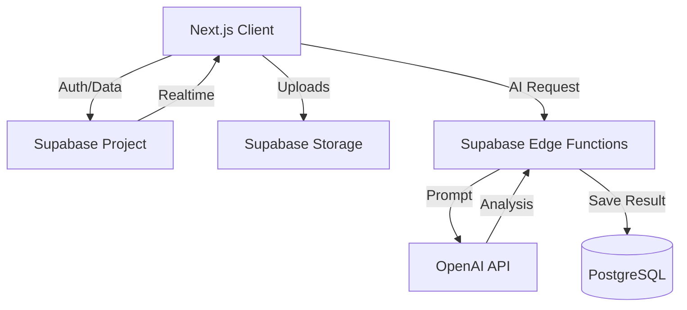

# AI Trading Journal - Product Specification

## 1. PRODUCT DESCRIPTION

### Purpose
The AI Trading Journal is a next-generation performance analytics platform designed to help traders move from "gambling" to "business-like consistency." It acts as an automated accountability partner, using AI to analyze trading behavior, detect psychological pitfalls, and provide actionable feedback in real-time.

### Core Value
Most traders fail not because of their strategy, but because of poor execution and psychology (over-trading, revenge trading, poor risk management). This product solves that by:
1.  **Automating the boring stuff**: Auto-calculating metrics and tagging setups.
2.  **Revealing the invisible**: AI detects patterns the trader misses (e.g., "You lose 80% of trades taken after 11 AM EST").
3.  **Enforcing discipline**: Gamified consistency scores and active warnings.

### Target Users
*   **Retail Traders**: Forex, Crypto, and Stock traders looking to become profitable.
*   **Prop Firm Traders**: Users taking challenges (FTMO, Apex) who need to strictly manage drawdown.
*   **Crypto Degens**: High-frequency traders needing quick logging and emotional checks.

### What Problems It Solves
*   "I don't know why I'm losing." -> AI Analysis reveals the root cause.
*   "I'm too lazy to journal." -> One-click import and screenshot analysis.
*   "I keep blowing accounts." -> Risk management alerts and drawdown tracking.

### Why Someone Would Pay
*   To save time on manual data entry.
*   To save money by avoiding costly recurring mistakes identified by AI.
*   To pass prop firm challenges by adhering to strict risk rules monitored by the app.

### How AI Makes It Different
Unlike Excel or basic journals (TradeZella, CoinMarketMan) which just *show* data, this app *interprets* it. It doesn't just say "Winrate: 40%"; it says "Your winrate is 40%, but if you removed Longs on EURUSD during the Asian session, it would be 65%."

---

## 2. FEATURES LIST

### A. Authentication & Profiles
*   **Supabase Auth**: Email/Password, Google OAuth, Discord OAuth.
*   **User Settings**:
    *   Base currency (USD, EUR, GBP, BTC).
    *   Timezone (auto-detect + override).
    *   Risk preferences (Risk per trade %, Max daily loss).
    *   Theme (Dark/Light/Midnight).

### B. Trade Entry System
*   **Manual Logging**: Fast entry form (Pair, Direction, Entry Price, Exit Price, Lots/Size, Date).
*   **Auto-Calculations**:
    *   P&L ($ and %).
    *   R-Multiple (Risk:Reward realized).
    *   Pip/Point value.
    *   Drawdown during trade (MAE/MFE).
*   **CSV Import**: Support for MetaTrader 4/5, cTrader, Binance, Bybit exports.
*   **Media**: Drag-and-drop screenshot upload (Entry chart, Exit chart).
*   **Tagging**:
    *   **System Tags**: Long/Short, Session (London/NY), Day of Week.
    *   **Custom Tags**: "Breakout", "Rejection", "FOMO", "Revenge".
    *   **AI Auto-Tagging**: AI analyzes notes/screenshots to suggest tags.

### C. Analytics Dashboard
*   **Core Metrics**: Winrate, Profit Factor, Total P&L, Average R:R.
*   **Equity Curve**: Visual graph of account growth over time.
*   **Drawdown Tracker**: Current drawdown from peak.
*   **Session Analysis**: Winrate/P&L split by Tokyo, London, NY sessions.
*   **Heatmaps**:
    *   Day of Week (Mon-Fri).
    *   Hour of Day.
*   **Setup Performance**: Which strategy yields the best results?
*   **Discipline Tracker**: % of trades following the plan (based on tags/rules).
*   **Prop Firm Monitor**:
    *   Daily Loss Limit progress bar.
    *   Max Trailing Drawdown tracker.
    *   "Distance to Target" visualization.

### D. AI Assistant (The "Brain")
*   **Smart Trade Summaries**: LLM reads trade data + notes and writes a concise summary of *why* the trade worked or failed.
*   **Pattern Detection**: "I've noticed you tend to exit winners too early on Fridays."
*   **Psychology Check**: "Your notes indicate frustration. You took 3 losses in a row. Suggest taking a break."
*   **Pre-Session Plan**: AI generates a plan for the day based on yesterday's mistakes and today's market news (optional external API).
*   **Warning System**: Real-time alert if a logged trade violates risk rules (e.g., "Risk is 3%, your limit is 1%").

### E. Journal Notes System
*   **Daily Review**: Structured form: "What did I do well?", "What did I do poorly?", "Grade for the day".
*   **Weekly Outlook**: Plan for the week ahead.
*   **AI Feedback**: AI grades the daily review and offers 3 improvement tips.

### F. Exporting
*   **PDF Report**: Professional monthly performance report for investors/mentors.
*   **CSV Export**: Full raw data dump.
*   **Mentor Link**: Read-only public link to specific trades or dashboards.

### G. Gamification
*   **Consistency Score**: 0-100 score based on risk adherence and journaling habit.
*   **Streaks**: "7 Days of Journaling".
*   **Badges**: "Sniper" (High R:R), "Machine" (No emotional trades), "Survivor" (Recovered from drawdown).

---

## 3. TECHNICAL STACK & ARCHITECTURE

### Frontend
*   **Framework**: Next.js 14 (App Router).
*   **Styling**: Tailwind CSS + Shadcn/UI (for premium components).
*   **State Management**: React Query (TanStack Query) for server state, Zustand for local state.
*   **Charts**: Recharts or Tremor for beautiful analytics.
*   **Icons**: Lucide React.

### Backend
*   **Platform**: Supabase (BaaS).
*   **Database**: PostgreSQL.
*   **Auth**: Supabase Auth.
*   **Storage**: Supabase Storage (Buckets for images/docs).
*   **Edge Functions**: Deno/Node.js functions for AI processing and heavy calculations.

### AI Pipeline
1.  **Trigger**: User logs trade or requests review.
2.  **Processing**: Next.js API route calls OpenAI API (GPT-4o or similar).
3.  **Context**: Prompt includes last 10 trades, user settings, and current trade details.
4.  **Output**: JSON response parsed and stored in `ai_reports` table.

### System Architecture


---

## 4. DATABASE SCHEMA

### 1. `users`
*   `id` (UUID, PK): Links to Supabase Auth.
*   `email` (Text): User email.
*   `username` (Text): Display name.
*   `created_at` (Timestamp).
*   `settings` (JSONB): { theme, currency, timezone, risk_per_trade }.
*   `subscription_tier` (Text): 'free', 'pro', 'enterprise'.

### 2. `accounts` (Portfolios)
*   `id` (UUID, PK).
*   `user_id` (UUID, FK -> users.id).
*   `name` (Text): e.g., "FTMO Challenge 1".
*   `initial_balance` (Numeric).
*   `current_balance` (Numeric).
*   `currency` (Text).

### 3. `trades`
*   `id` (UUID, PK).
*   `account_id` (UUID, FK -> accounts.id).
*   `pair` (Text): e.g., "EURUSD".
*   `direction` (Text): 'LONG' or 'SHORT'.
*   `entry_price` (Numeric).
*   `exit_price` (Numeric).
*   `size` (Numeric): Lots/Units.
*   `pnl` (Numeric): Profit/Loss amount.
*   `pnl_percentage` (Numeric).
*   `open_time` (Timestamp).
*   `close_time` (Timestamp).
*   `setup_type` (Text): User defined strategy.
*   `notes` (Text).
*   `screenshot_entry_url` (Text).
*   `screenshot_exit_url` (Text).
*   `mae` (Numeric): Max Adverse Excursion.
*   `mfe` (Numeric): Max Favorable Excursion.
*   `status` (Text): 'OPEN', 'CLOSED', 'BE' (Break Even).

### 4. `tags`
*   `id` (UUID, PK).
*   `trade_id` (UUID, FK -> trades.id).
*   `name` (Text): e.g., "FOMO", "A+ Setup".
*   `type` (Text): 'manual', 'ai_generated'.

### 5. `sessions` (Analytics Cache)
*   `id` (UUID, PK).
*   `trade_id` (UUID, FK -> trades.id).
*   `session_name` (Text): 'ASIA', 'LONDON', 'NY'.
*   `day_of_week` (Text): 'Monday', etc.

### 6. `ai_reports`
*   `id` (UUID, PK).
*   `user_id` (UUID, FK -> users.id).
*   `type` (Text): 'trade_review', 'daily_summary', 'pattern_alert'.
*   `content` (JSONB): Structured AI output.
*   `created_at` (Timestamp).

### 7. `daily_journal`
*   `id` (UUID, PK).
*   `user_id` (UUID, FK -> users.id).
*   `date` (Date).
*   `mood` (Text).
*   `notes` (Text).
*   `rating` (Integer): 1-10.

### 8. `achievements`
*   `id` (UUID, PK).
*   `user_id` (UUID, FK -> users.id).
*   `badge_code` (Text).
*   `unlocked_at` (Timestamp).

---

## 5. USER FLOWS

### 1. Signing Up
1.  User lands on LP -> Clicks "Start Free".
2.  Supabase Auth (Email/Pass or Google).
3.  **Onboarding Wizard**:
    *   "What is your base currency?"
    *   "What markets do you trade?"
    *   "Set your first trading goal."
4.  Redirect to Dashboard (Empty State).

### 2. Logging a Trade
1.  Click "+" FAB (Floating Action Button).
2.  **Form Modal** opens.
3.  Enter Pair, Direction, Entry/Exit prices (or paste from clipboard).
4.  Upload Screenshot (optional).
5.  Add tags (e.g., "Impulse Entry").
6.  Click "Save".
7.  **Backend**: Calculates P&L, R:R, assigns Session based on time.
8.  **AI Trigger**: Async job analyzes trade and adds "AI Insights" notification.

### 3. Generating AI Report
1.  User navigates to "AI Coach" tab.
2.  Selects "Weekly Review".
3.  System fetches last 7 days of trades + journal entries.
4.  Sends prompt to LLM.
5.  Displays structured report: "Top Mistake: Over-trading Tuesday NY Open. Best Setup: Gold Rejections."

### 4. Daily Review
1.  End of day -> User clicks "Daily Review".
2.  Shows list of today's trades.
3.  Asks: "How did you feel today?" (Slider).
4.  Asks: "Did you follow your plan?" (Yes/No).
5.  AI generates a "Day Grade" (A-F) and specific advice for tomorrow.

---

## 6. UI/UX DESIGN SYSTEM

### Visual Identity
*   **Theme**: "Bloomberg Terminal meets Cyberpunk". Dark mode default.
*   **Palette**:
    *   Background: `#09090B` (Zinc 950)
    *   Surface: `#18181B` (Zinc 900)
    *   Primary: `#10B981` (Emerald 500 - Profit)
    *   Destructive: `#EF4444` (Red 500 - Loss)
    *   Accent: `#6366F1` (Indigo 500 - AI/Tech)
    *   Text: `#FAFAFA` (Zinc 50)
*   **Typography**: `Inter` (UI) + `JetBrains Mono` (Numbers/Data).

### Layout Structure
*   **Sidebar (Left)**: Navigation (Dashboard, Journal, Trades, Analytics, AI Coach, Settings).
*   **Top Bar**: Breadcrumbs, Account Selector, User Profile.
*   **Main Content**: Grid-based dashboard widgets.

### Wireframe (Dashboard)
```text
+----------------+---------------------------------------------------+
|  LOGO   [+]    |  Home > Dashboard              [Account: FTMO 1]  |
+----------------+---------------------------------------------------+
|  Dashboard     |  [ P&L Graph (Line Chart)                       ] |
|  Journal       |  [                                              ] |
|  Trades        |  [______________________________________________] |
|  Analytics     |                                                   |
|  AI Coach      |  [ Winrate 65% ]  [ P&L +$1,240 ]  [ DD -2.1% ]   |
|  Settings      |                                                   |
|                |  [ Recent Trades Table ----------------------- ]  |
|                |  | EURUSD | Long | +2.5R | WIN  | [AI Check] |  |
|                |  | GBPJPY | Short| -1.0R | LOSS | [AI Warn ] |  |
|                |  |_____________________________________________|  |
+----------------+---------------------------------------------------+
```

---

## 7. AI LOGIC & PROMPTS

### A. AI Trade Review Prompt
**Input**: Trade JSON (Entry, Exit, Tags, Notes, MAE/MFE).
**System Prompt**:
"You are a professional trading psychology coach and risk manager. Analyze the following trade.
Identify:
1. Execution errors (e.g., wide stop loss, poor R:R).
2. Psychological flags based on notes (e.g., 'felt scared' -> anxiety).
3. Constructive feedback.
Output JSON: { 'mistakes': [], 'psychology_score': 1-10, 'feedback': '' }"

### B. Pattern Detection Prompt
**Input**: List of last 50 trades.
**System Prompt**:
"Analyze this dataset of 50 trades. Find correlations between:
- Time of day and Winrate.
- Asset class and Profitability.
- Long/Short bias.
Output the top 3 strongest patterns (positive or negative).
Example: 'You have a 80% loss rate on GBPUSD between 14:00 and 16:00.'"

### C. Daily Plan Prompt
**Input**: Yesterday's performance + Today's high-impact news events (if available).
**System Prompt**:
"Based on the user's recent tendency to over-trade after a loss, generate a pre-session plan.
Rules to enforce:
1. Max 2 trades today.
2. Stop trading if -1R is hit.
Output a bulleted 'Battle Plan' for the session."

---

## 8. SECURITY & SCALABILITY

### Security
*   **RLS (Row Level Security)**: Every table has `auth.uid() = user_id` policy. Users can ONLY see their own data.
*   **Encryption**: All data in transit (TLS). Sensitive user settings encrypted at rest.
*   **File Uploads**: Supabase Storage policies restricting access to owner only.
*   **Rate Limiting**: API routes limited to 100 requests/min to prevent abuse.

### Scalability
*   **Database**: PostgreSQL handles millions of rows easily. Indexing on `user_id`, `date`, and `pair` for fast queries.
*   **Caching**: React Query caches data on client. Edge functions cache heavy AI responses.
*   **Backup**: Supabase Point-in-Time Recovery (PITR).

---

## 9. DEVELOPMENT ROADMAP

### Phase 1: MVP (Weeks 1-4)
*   Auth & User Profiles.
*   Manual Trade Entry.
*   Basic Dashboard (P&L, Winrate).
*   Simple AI Trade Review (Single trade).

### Phase 2: Beta (Weeks 5-8)
*   CSV Import.
*   Advanced Analytics (Heatmaps, Session split).
*   Journal/Notes system.
*   Pattern Detection AI.

### Phase 3: Production (Weeks 9-12)
*   Gamification (Badges, Streaks).
*   Public Share Links.
*   Mobile Responsive Polish.
*   Stripe Integration for Payments.

---

## 10. BUSINESS MODEL & PRICING

### Freemium Model
*   **Free Tier**:
    *   Manual logging only.
    *   Basic stats (Winrate, P&L).
    *   Limit 50 trades/month.
    *   No AI.
*   **Pro Tier ($29/mo)**:
    *   Unlimited trades.
    *   CSV Import.
    *   Full AI Suite (Coach, Patterns, Reviews).
    *   Advanced Analytics.
*   **Enterprise/Prop**:
    *   Team management.
    *   Risk desk view for managers.

### Monetization Strategy
*   **Monthly Subscription**: Recurring revenue.
*   **Lifetime Deal (Early Bird)**: Cash injection for dev.
*   **AI Credit Packs**: Pay-as-you-go for heavy AI usage if API costs get high.
